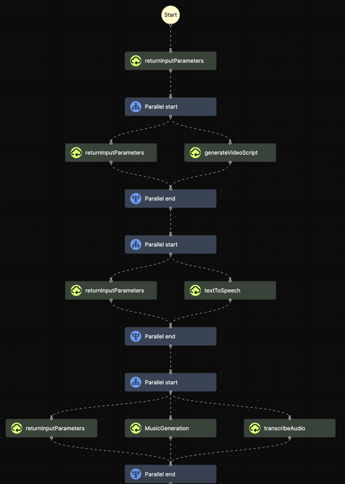
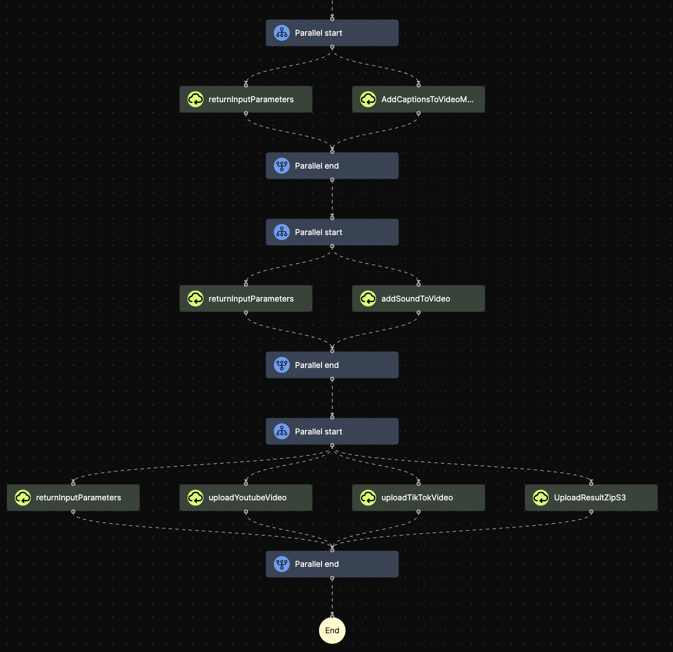

# AI video generator agent


This AI-agent utilizes generative AI to automatically generate short videos and post them on social platforms.
It integrates several AI domains such as script generation, image generation, music generation, speech generation, automatic captioning, special effects, automatic upload and video composition to create engaging and high-quality videos.
The agent is hosted on [Mindsflow.ai](https://mindsflow.ai/).

## Features

- **Script Generation**: uses [GPT4](https://openai.com/gpt-4) to generate compelling scripts for your videos.

- **Image Generation**: Based on the script, it generates relevant and visually appealing frames using [StableDiffusionXL](https://replicate.com/stability-ai/sdxl).

- **Music Generation**: The system can create original, fitting background music to enhance the mood and tone of the video. It leverages a [music generation](https://replicate.com/meta/musicgen) model

- **Speech Generation**: Using [Azure-API](https://azure.microsoft.com/en-us/products/ai-services/text-to-speech), the agent can also generate human-like narrations for the scripts. It supports multiple languages.

- **Automatic Captioning**: This feature ensures accessibility by providing accurate captions for the generated speech. Captions are generated with [ffmpeg](https://ffmpeg.org/about.html).

- **Special Effects**: The agent includes the ability to apply various special effects to the video to make it more engaging using [moviepy](https://pypi.org/project/moviepy/).

- **Video Composition**: The agents is based on a [flow-based programming](https://en.wikipedia.org/wiki/Flow-based_programming) model to assemble different AI and algorithmic components into a complete video. The flow is developed and hosted on [Mindsflow.ai](https://mindsflow.ai/). All the blocks of the flow are available [here](agent-video-generator/functions).

- **Automatic upload**: Once the video is ready, the agent can automatically upload it on your favourite social media platform.

**Note**: running this agent requires to have an OpenAI key, [Replicate](https://replicate.com/explore) key, and Azure API key.

## Results

You can check out some sample videos at the following links:

1. [https://www.instagram.com/inspiration_daily_tales/](https://www.instagram.com/inspiration_daily_tales/)

2. [https://www.tiktok.com/@inspiration_tales_daily](https://www.tiktok.com/@inspiration_tales_daily)

These samples provide a glimpse of what the video-generator agent is capable of. Happy viewing!

## Flow

| Part 1                              | Part 2                              | Part 3                              |
|-------------------------------------|-------------------------------------|-------------------------------------|
|  |  |  |

For more details you see the full images [here](./results/flow/).

## Input format

```
{
"topic": "topic of the video",  # example: benefits of eating mango
"language": "en",  # narration language
"speaker": "en-US-GuyNeural",  # (full list of voices: https://learn.microsoft.com/en-us/azure/ai-services/speech-service/language-support?tabs=tts)
"voice_speed": 1, # (<1 slower voice, >1 faster voice)
"font_size": 30,  # font size in pixels
"font_name": "SourceSerif4",  # font type
"font_size_title": 50,  # title font size in pixels
"text_color": "white",  # subtitles color
"text_bg_color": "",  # subtitles bg color, "" or "none" means no bg color
"text_bg_opacity": 0,  # subtitles bg opacity, in [0-1], 0->transparent, 1->full
"text_border_color": "none",  # subtitles border color
"text_border_size": 0,  # subtitles border size, 0 no border
"caption_position": "center",  # center, top, bottom
"height": 1024,  # video height in pixels
"width": 576,  # video width in pixels
"fps": 16,  # video fps
"image_model": "sdxl",  # model to generate frames: sd or sdxl
"music_volume": 0.5,  # volume of bg music, in [0-1], 0->no bg music
"transition_time": 1,  # frames transitions time, 0->instant transition
"zoom": 1.1,  # frames zoom in/out strength, 1->no zoom
"account_name": "mindsflow.ai",  # account name, only if you want the video to be automatically uploaded on your platform
"upload": false,  # whether to upload the video on social media
"image_duration": 6,  # duration of each image
}
```

**Note**: The only compulsory field is "topic". If not specified, all other fields will be set to their default values.

## Output format

The output of the agent is structured in the following way:

```
{
"result": "link to result"
}
```
In this output, result is a link pointing to a ZIP file. This ZIP file contains:

- The generated video in mp4 format
- A thumbnail image for the video
- The video script in text format
- The captions file in srt format

## Extra

Try out more AI agents at [https://chat.mindsflow.ai/en-US/explore](https://chat.mindsflow.ai/en-US/explore).