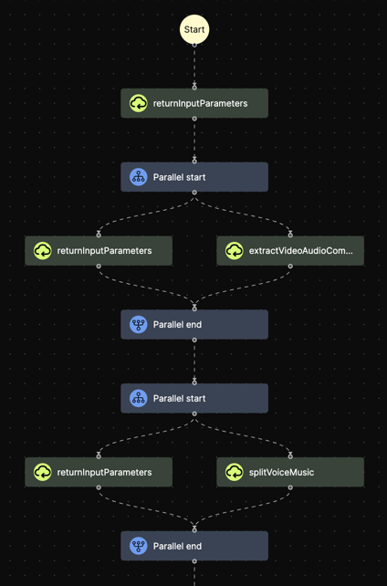
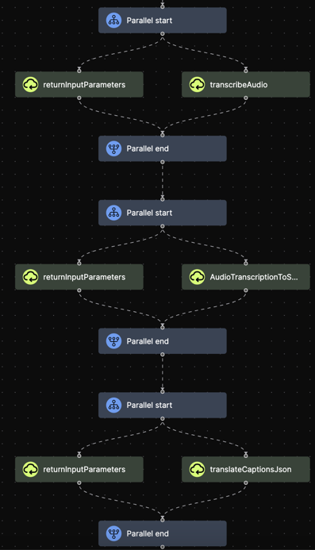
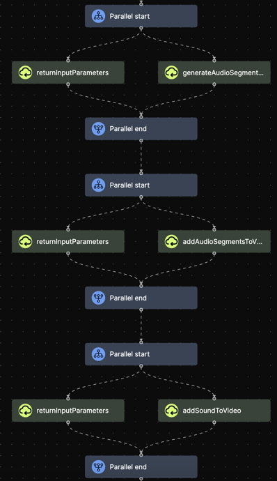

# AI video translator agent


This project utilizes advanced AI techniques to translate the spoken language in videos from one language to another.
It also incorporates an automatic caption generation system that generates translated subtitles for improved accessibility and understanding.
The agent is hosted on [Mindsflow.ai](https://mindsflow.ai/).

## Features

- **Automatically translated speech**: Using [Azure-API](https://azure.microsoft.com/en-us/products/ai-services/text-to-speech), the agent can translate the speech of the original video to a target language.

- **Automatically translated captions**: Video speech transcription is first translated with [googletrans](https://pypi.org/project/googletrans/), then translated captions are added to the video with [ffmpeg](https://ffmpeg.org/about.html).

- **Automatic upload**: Once the video is ready, the agent can automatically upload it on your favourite social media platform.

- **Flow-based programming**: The agents is based on a [flow-based programming](https://en.wikipedia.org/wiki/Flow-based_programming) model to assemble different AI and algorithmic components into a complete video. The flow is developed and hosted on [Mindsflow.ai](https://mindsflow.ai/). All the blocks of the flow are available [here](agent-video-generator/functions).

**Note**: running this agent requires to have an [Azure API](https://azure.microsoft.com/en-us/products/api-management/?ef_id=_k_Cj0KCQiA5-uuBhDzARIsAAa21T9Ii5vg2kAFHYwFfD2k7pnFp1Rg-HbVmvAOKfTrqq5Ue2TfbAIdahEaAmkWEALw_wcB_k_&OCID=AIDcmmy6frl1tq_SEM__k_Cj0KCQiA5-uuBhDzARIsAAa21T9Ii5vg2kAFHYwFfD2k7pnFp1Rg-HbVmvAOKfTrqq5Ue2TfbAIdahEaAmkWEALw_wcB_k_&gad_source=1&gclid=Cj0KCQiA5-uuBhDzARIsAAa21T9Ii5vg2kAFHYwFfD2k7pnFp1Rg-HbVmvAOKfTrqq5Ue2TfbAIdahEaAmkWEALw_wcB) key.

## Results

In the following table you can watch some generated samples.

| Original                                                     | Translation (Chinese)                                |
|--------------------------------------------------------------|------------------------------------------------------|
| https://youtube.com/shorts/wKOBppgV2R0?feature=share | https://youtube.com/shorts/Zbk02MsAoko?feature=share |
| https://youtube.com/shorts/6dgCNjVMBpM?feature=share | https://youtube.com/shorts/wbZbhVQmpNw?feature=share |
| https://youtube.com/shorts/wKOBppgV2R0?feature=share | https://youtube.com/shorts/GCIVzEHeeqM?feature=share |
| https://youtu.be/ERfDdZq9ve8 | https://youtu.be/a1tKgG0UP6A                         |

More results are available on [Douyin](https://www.douyin.com/user/MS4wLjABAAAAnDmwuk2SS4WBc8swBbYhtbGpH1Mrp3nlHrTnMcyDJdW5RUsr4BCajyo716Wyc76L?is_search=0&list_name=follow&nt=0)

## Flow

| Part 1                                            | Part 2                              | Part 3                              |
|---------------------------------------------------|-------------------------------------|-------------------------------------|
|  |  |  |

For more details you see the full images [here](./results/flow/translation/).

## Input format

```
{
"voice": "zh-CN-YunfengNeural",  # (full list of voices: https://learn.microsoft.com/en-us/azure/ai-services/speech-service/language-support?tabs=tts)
"video_url": "video_to_translate.mp4",  # link to the video to be translated. It must point to a video mp4 file stored online.
"source_language": "en",  # video original language
"target_language": "zh",  # language to translated the video
"account_name": "mindsflow.ai",  # account name, only if you want the video to be automatically uploaded on your platform
"upload": false,  # whether to upload the video on social media
}
```

## Output format

The output of the agent is structured in the following way:

```
{
"result": "link to result"
}
```
In this output, result is a link pointing to a ZIP file. This ZIP file contains:

- The generated video in mp4 format
- The original video in mp4 format
- The video original subtitles in srt text format
- The video translated subtitles in srt text format

## Extra

Try out more AI agents at [https://chat.mindsflow.ai/en-US/explore](https://chat.mindsflow.ai/en-US/explore).